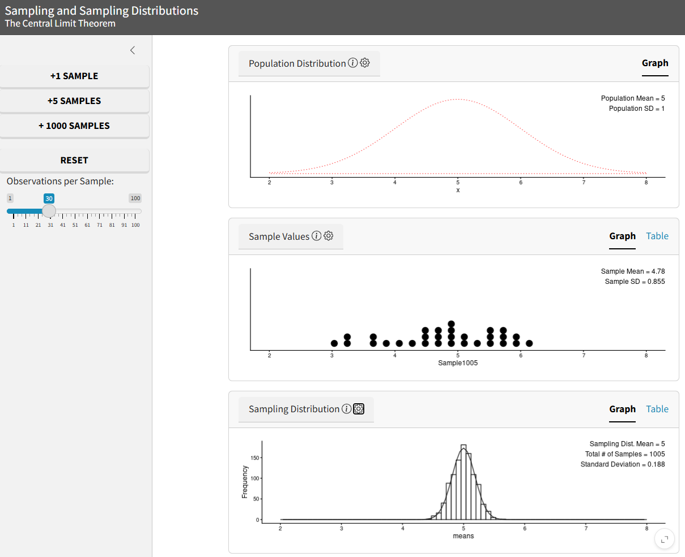

```{r, echo=FALSE}
library(shiny)
```

{width='50%'}

## About the application

Shinylive Webpage: [https://falkcarl.github.io/clt/](https://falkcarl.github.io/clt/)

Code (GitHub): [https://github.com/falkcarl/clt](https://github.com/falkcarl/clt)

This module is presented dashboard-style an in part inspired by the well-known Java/Javascript app by Rice Virtual Lab in Statistics: [https://onlinestatbook.com/stat_sim/sampling_dist/](https://onlinestatbook.com/stat_sim/sampling_dist/). Note that modified versions of this older app are also available (e.g., [https://nmimoto.github.io/applets/CLT/index.html](https://nmimoto.github.io/applets/CLT/index.html)).

Our contributions are twofold.

First, there are several modifications for pedagogical purposes.

- The UI is simplified to avoid overwhelming students with too many obvious things to click on
    - Only the sample size and number of sample to draw stand out.
- But, other features are still technically available
    - The population distribution or displayed information about the plots or dataset is available via clickable gear icons, `r shiny::icon("gear")`
    - Information about each plot can pop up by hovering over an info icon, `r shiny::icon("info-circle")`

A possible learning activity along with questions also accompanies the dashboard. Currently these appear on the same page below the app, though some of the questions are currently under revision. The instructor may of course design their own learning activity that uses the application to serve their own pedagogical approach.

Secondly, our app is a [shinylive](https://posit-dev.github.io/r-shinylive/) version; the underlying code is R, not Javascript. We envision this as being more readily extensible in future versions to illustrating more kinds of sampling distributions other than just the sample mean or other distributions where the central limit theorem breaks (e.g., Cauchy), and the code is available in the above GitHub repository under an AGPL-3 license. However, some caveats are that shinylive appears to require more overhead in terms of the amount of data to download, can be slightly slower to respond, and we did not implement animation.

## Other resources

Not written by us, but this extra reading may be helpful:

Zhang, X., Astivia, O. L. O., Kroc, E., & Zumbo, B. D. (2023). How to think clearly about the central limit theorem. *Psychological Methods, 28(6)*, 1427–1445. [https://doi.org/10.1037/met0000448](https://doi.org/10.1037/met0000448)
Preprint version: [https://osf.io/d8xz5](https://osf.io/d8xz5)


