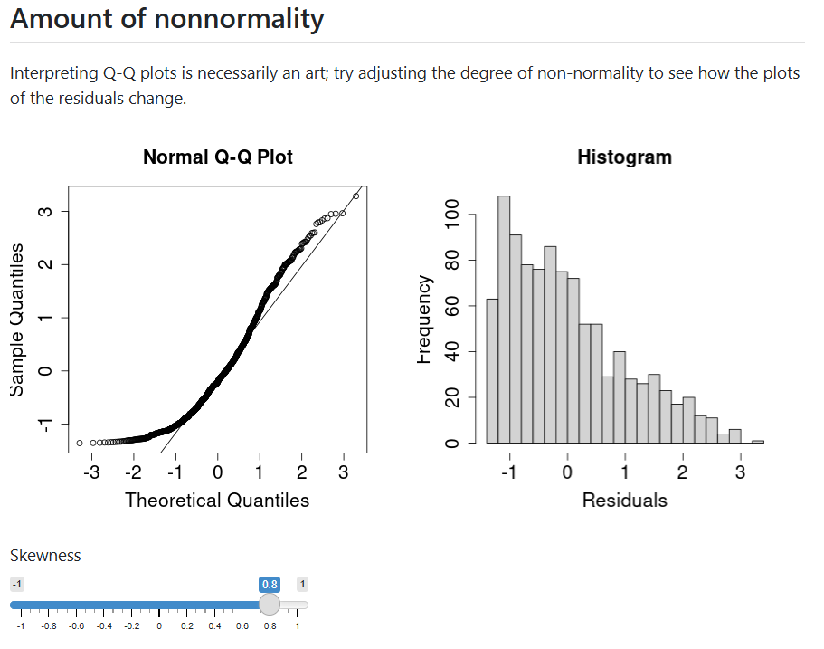

{width='50%'}

## About the application

Shinylive Webpage: [https://falkcarl.github.io/mlrassume/](https://falkcarl.github.io/mlrassume/)

Code (GitHub): [https://github.com/falkcarl/mlrassume/](https://github.com/falkcarl/mlrassume/)

This module is presented as a webpage with interactive components, with the intention that it could be considered a chapter in an interactive textbook. While typical presentations of the assumptions of multiple linear regression are often static and contain just a few examples, we aimed for something that could generate many more examples and use simulations to illustrate the consequences of assumption violations. Through this approach, we hope that students will also gain an appreciation of how it is that researchers study the robustness of statistical techniques through simulations.

The module thus begins with a brief overview of how we might evaluate the robustness of an estimation approach. While traditionally statisticians (or quantitative psychologists, biostatisticians, econometricians, etc.) may focus on traditional theoretical metrics to judge an estimator (e.g., bias, consistency, efficiency, mean-squared error), we avoided formal mathematical notation for these concepts. Instead, we return to the concept of a sampling distribution---a concept that many of our interactive statistics modules emphasize---to illustrate how some of its properties could go wrong.

Students then dive into particular assumptions. They can visualize typical diagnostics where datasets at varying levels of nonnormality or heteroscedasticity are generated on the fly. They can also examine what the sampling distribution and consequences might when these assumptions are violated. We found that such simulations were rather computationally intensive for [shinylive](https://posit-dev.github.io/r-shinylive/). At the moment, we focus on just a few assumptions, but intend to add more in the future.
