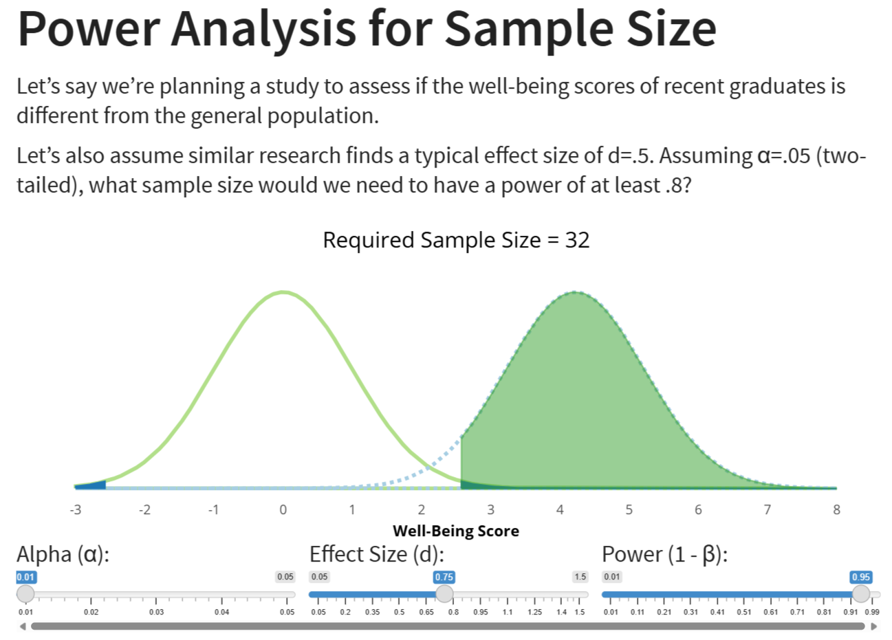

{width='50%'}

## About the application

Shinylive Webpage: [https://jeremyjjrappel.com/StatisticalPower/](https://jeremyjjrappel.com/StatisticalPower/) (to advance the slides, use the right arrow on the keyboard)

Code (GitHub): [https://github.com/JR-McGill/StatisticalPower/tree/shinylive](https://github.com/JR-McGill/StatisticalPower/tree/shinylive)

This module is presented in the style of a brief slide-deck but with interactive components. The setup is a typical two-group analysis and presents the null distribution and alternative distribution conceptually. Students can visualize how effect size, sample size, and alpha affect statistical power, as well as obtain a brief preview to how power analysis for sample size planning may work.