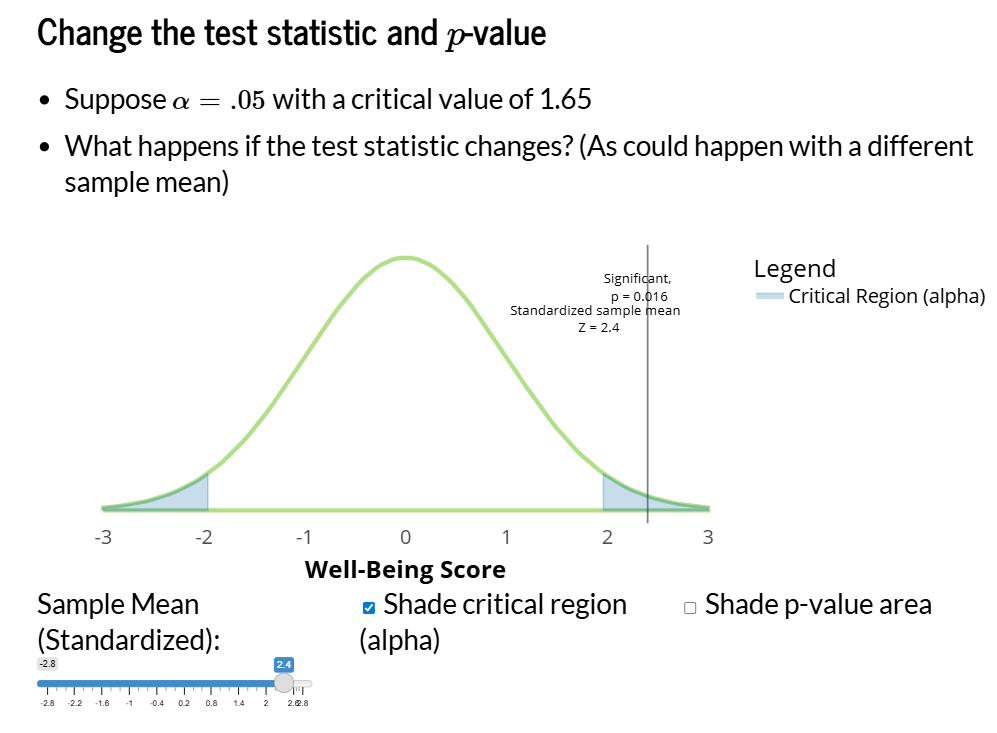

{width='50%'}

## About the application

Shinylive Webpage: [https://falkcarl.github.io/h0test/](https://falkcarl.github.io/h0test/) (to advance the slides, use the right arrow on the keyboard)

Code (GitHub): [https://github.com/falkcarl/h0test/](https://github.com/falkcarl/h0test/)

This module is presented in the style of a slide-deck with interactive components. It also takes advantages of revealjs's ability to scroll horizontally (the usual way one proceeds through presentations) as well as vertically (for optional reviews or learning checks).

The initial goal was to help students understand the difference between $p$-values and $\alpha$ and their corresponding obtained test statistic and critical values. In doing so, we provided review of some fundamental concepts: Sampling distributions, normal distributions, standardized scores.