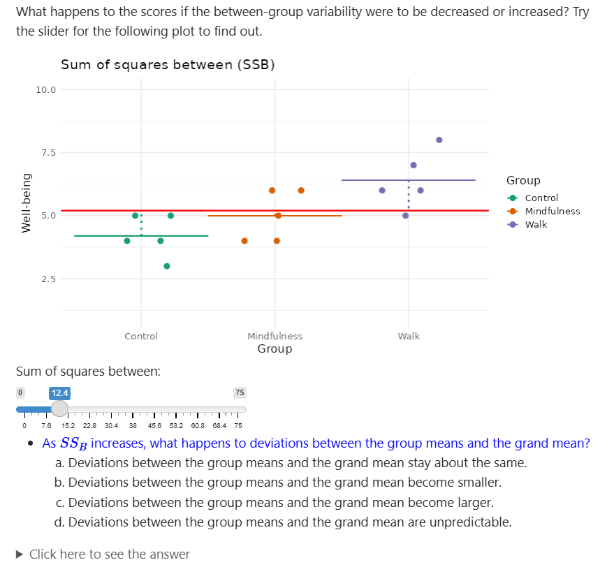

{width='50%'}

Shinylive Webpage: [https://falkcarl.github.io/ANOVAvar/](https://falkcarl.github.io/ANOVAvar/)

Code (GitHub): [https://github.com/falkcarl/ANOVAvar](https://github.com/falkcarl/ANOVAvar)

This module is presented as a webpage with interactive components, with the intention that it could be considered a chapter in an interactive textbook. It begins with a review of variance before detailing the partitioning of variance in a one-way between-subjects ANOVA. Questions to aid students' understanding as they progress are sprinkled throughout the text, and interactive components include plots with sliders to independently create more or less between-group (model) and within-group (residual) variability, what the F-distribution looks like a different degrees of freedom, and the tradeoff between model and residual variance in determining the observed $F$-statistic. It does not (yet) cover other topics that are related to one-way ANOVA, such as assumptions or post-hoc tests.
